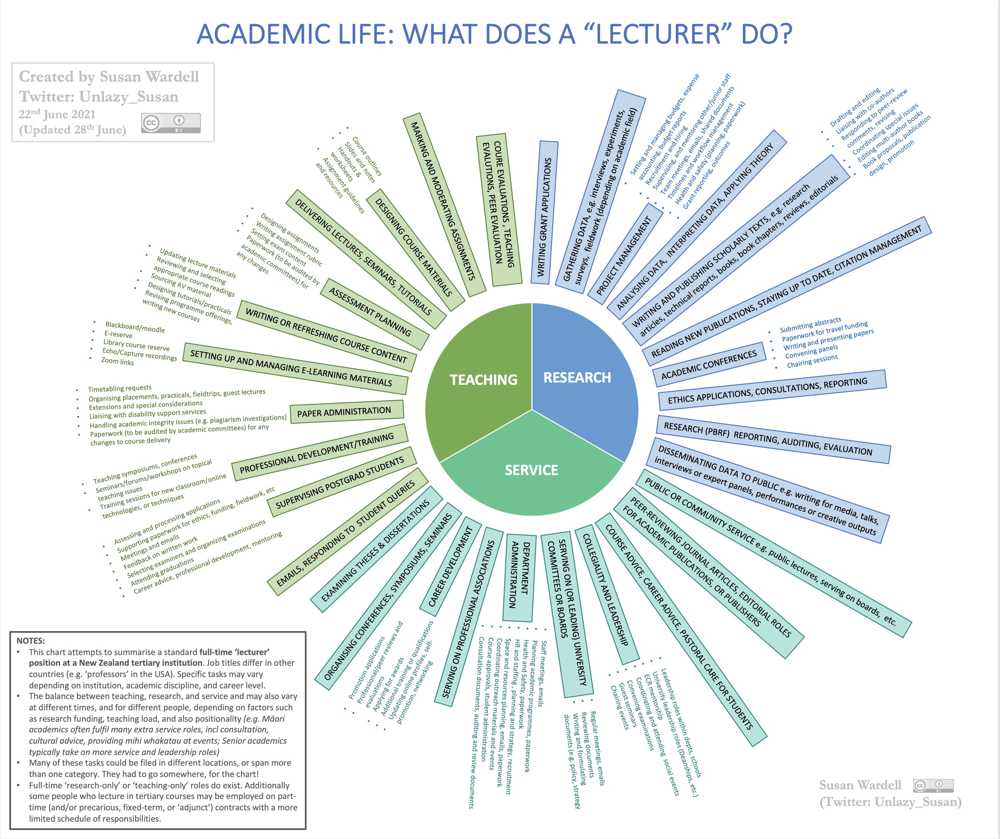

# Notes for job seekers 

 

The listing is intended primarily for bioinformatics, biostatistics, computational jobs. Most of the job web sites allow to create alerts customized with relevant keywords. Also, post your resume, where available.

Please, [contribute and get in touch](CONTRIBUTING.md)! See [MDmisc notes](https://github.com/mdozmorov/MDmisc_notes) for other programming and genomics-related notes.

# Table of content

<!-- START doctoc generated TOC please keep comment here to allow auto update -->
<!-- DON'T EDIT THIS SECTION, INSTEAD RE-RUN doctoc TO UPDATE -->

- [Resources](#resources)
- [CV, resume templates](#cv-resume-templates)
- [Job material](#job-material)
  - [NIH OTIE video](#nih-otie-video)
  - [Talk](#talk)
  - [Interview](#interview)
  - [Ten simple rules](#ten-simple-rules)
  - [Letters of recommendation](#letters-of-recommendation)
- [Misc](#misc)

<!-- END doctoc generated TOC please keep comment here to allow auto update -->

## Resources

- [NatureJobs](https://www.nature.com/naturecareers) - jobs posted by Nature journal
- [ScienceCareers](https://jobs.sciencecareers.org/) - jobs posted by Science journal
- [Cell Career Network](http://jobs.cell.com/) - jobs posted by Cell journal
- [AcademicKeys](https://www.academickeys.com/) - Higher Ed Job Announcements
- [The Chronicle of Higher Education](https://www.chronicle.com/) - find/post higher ed jobs
- [Inside Higher Ed](https://careers.insidehighered.com/) job search and posting
- [UnivCollegeJobs](https://univcollegejobs.com/) - Academic Jobs University College Teaching Education Higher Ed
- [FACEB jobs](https://careers.faseb.org/jobs/) - jobs posted by Federation of American Societies for Experimental Biology
- [usajobs.gov](https://www.usajobs.gov/) - jobs in federal government
- [Juju](http://www.juju.com/) - jobs in industry
- [AcademicJobsOnline](https://academicjobsonline.org) - jobs in academia
- [LinkedIn](https://www.linkedin.com/jobs/)
- [ResearchGate](https://www.researchgate.net/jobs)
- [Glassdoor](https://www.glassdoor.com)
- [ISCB careers](https://careers.iscb.org) - bioinformatics and computational jobs in academia
- [Bioinformatics.org](https://www.bioinformatics.org/jobs/) - bioinformatics jobs forum
- [MSD jobs](https://jobs.msd.com/) - Merck job board
- [EuroPharmaJobs](https://www.europharmajobs.com/) - jobs in Europe
- [QuantBio](https://docs.google.com/spreadsheets/d/1Kfx9yxPsSmwG4rGartrbngCZAKnXSP2qB384pGP2qqU/edit#gid=513847731) - crowdsource jobs listing, for faculty and postdoc positions
- [GeneticsCareers.org](http://geneticscareers.org/) - the jobs board provided by the Genetics Society of America
- [THEORETICAL COMPUTER SCIENCE JOBS](https://cstheory-jobs.org) - listings and the possibility to post
- [Lists of bioinformatics job posting, LinkedIn groups, by Nicolas Descostes](https://github.com/descostesn/jobposting), [source](https://twitter.com/NDescostes/status/1165973907716890624?s=03)

- [Resources for faculty by Ming Tang](https://github.com/crazyhottommy/The-world-of-faculty)

## CV, resume templates

- [Awesome-CV](https://github.com/posquit0/Awesome-CV) - LaTeX templates for resume and cover letter. [Example pdf](https://raw.githubusercontent.com/posquit0/Awesome-CV/master/examples/resume.pdf) and editable version on [Overleaf]
(https://www.overleaf.com/latex/templates/awesome-cv/tvmzpvdjfqxp)
- [vitae](https://pkg.mitchelloharawild.com/vitae/) - an R package with Templates and tools for making a Résumé/CV. [GitHub](https://github.com/mitchelloharawild/vitae), [CRAN](https://cloud.r-project.org/package=vitae)
- [How To Build An Amazing LinkedIn Profile (15+ Proven Tips)](https://www.freecodecamp.org/news/how-to-build-an-amazing-linkedin-profile-15-proven-tips/)
- [A collection of cv and resume templates written in LaTeX](https://github.com/jankapunkt/latexcv)
- [Templates and tools for making a Résumé/CV, vitae R package](https://ropenscilabs.github.io/vitae/)
- [YAAC: Another Awesome CV is a template using Font Awesome and Adobe Source Font, LaTeX](https://github.com/darwiin/yaac-another-awesome-cv)
- RMarkdown CV built using the [pagedown](https://pagedown.rbind.io/) R package:
    - [Guangchuang Yu's CV](https://github.com/GuangchuangYu/cv)
    - [Nick Strayer's CV](https://github.com/nstrayer/cv)
- [Panel CV for designers (or engineers)](https://github.com/jekyller/PanelCV)

## Job material

- Examples of Research/Teaching, Diversity statements, Research proposals, [Future PI Slack Documents](https://drive.google.com/drive/folders/1ZNQXrOh_NJ7YKNajI8EC1329rGQzBjA4), [Sample Materials for Faculty Positions, UCSF](https://career.ucsf.edu/phds/academic-careers/academic-samples), [Successful Job and Grant Applications](https://github.com/RILAB/statements)

### NIH OTIE video

- [The Academic Job Search: Preparing Your Package (2022)](https://youtu.be/t7OsaP19gZ0)
- [The Academic Job Search: Preparing Your Job Package](https://youtu.be/PlnKyalOZ3s)
- [Industry Careers Overview & Job Packages](https://youtu.be/7DdvUw31aY4)
- [Networking for Scientists (2021)](https://youtu.be/F0dtHQ3PmlY)

### Talk

- [How To Tell Your Story Retention](https://www.dropbox.com/s/52ulhzkgzm78zix/How%20To%20Tell%20Your%20Story%20Retention%20Document.pdf?dl=0)

- [Chalk talks: how to avoid 10 pitfalls](https://sociobiology.wordpress.com/2016/10/11/chalk-talks-how-to-avoid-10-pitfalls/)

- Fleming, Nic. “[How to Give a Great Scientific Talk](https://www.nature.com/articles/d41586-018-07780-5).” Nature 564, no. 7736 (December 2018)

- [Tips for a Successful Job Talk, Inside Higher Ed](https://www.insidehighered.com/advice/2018/01/10/advice-giving-effective-job-presentation-opinion)

- [Giving a Job Talk in the Sciences, The Chronicle of Higher Education](https://www.chronicle.com/article/Giving-a-Job-Talk-in-the/45375)

### Interview

- [Interview tips](https://twitter.com/theantonioreza/status/1593630383035351040?s=20&t=ifOOfspsg8n7OUlbnQyIJA) Twitter thread by [Antonio Reza](https://twitter.com/theantonioreza), head of finance at Google. 

- Chan, Dalen, Christina M. Fitzsimmons, Mariana D. Mandler, and Pedro J. Batista. “[Ten Simple Rules for Acing Virtual Interviews](https://doi.org/10.1371/journal.pcbi.1009057).” PLOS Computational Biology 17, no. 6 (June 24, 2021) - 1) Keep it professional; 2) Test the technology; 3) Prepare the location; 4) Be an interviewer and an interviewee; 5) Keep a familiar routine, and pace yourself; 6) Communicate clearly, ask for clarification; 7) Embrace Murphy's law; 8) Connect with university's students/environment; 9) Send Follow-up e-mails; 10) Imagine the future. Primarily for students/postdocs. Table 1 - questions you'll be asked and can ask.

- [Questions to ask on an academic job interview, Dartmouth](https://graduate.dartmouth.edu/student-support/career-services/interview-practice-techniques/interviewing-academic-job)

- [Notes on interview questions, for faculty and postdoc positions. By Lauren Gatto](https://lgatto.github.io/interview-questions/)

- [R Programming: 35 Job Interview Questions and Answers](https://www.datasciencecentral.com/profiles/blogs/r-programming-job-interview-questions-and-answers)

### Ten simple rules

- Tregoning, John S., and Jason E. McDermott. “[Ten Simple Rules to Becoming a Principal Investigator](https://doi.org/10.1371/journal.pcbi.1007448).” PLOS Computational Biology 16, no. 2 (February 20, 2020)

- Sura, Shayna A., Lauren L. Smith, Monique R. Ambrose, C. Eduardo Guerra Amorim, Annabel C. Beichman, Ana C. R. Gomez, Mark Juhn, et al. “[Ten Simple Rules for Giving an Effective Academic Job Talk](https://doi.org/10.1371/journal.pcbi.1007163).” PLoS Computational Biology 15, no. 7 (July 2019) - Know your audience, sell yourself, impress the expert colleagues, appeal to the non-experts, summarize best of your best, give a good talk, make clear slides (recommendations provided), describe your vision, master Q&A session, be professional.

 - Bourne, Philip E. “[Ten Simple Rules for Getting Ahead as a Computational Biologist in Academia](https://doi.org/10.1371/journal.pcbi.1002001).” PLoS Computational Biology 7, no. 1 (January 6, 2011) - Tips for emphasizing your strengths in CV, job applications, promotion letters

- Bourne, Philip E. “[Ten Simple Rules for Making Good Oral Presentations](https://doi.org/10.1371/journal.pcbi.0030077).” PLoS Computational Biology 3, no. 4 (April 27, 2007) - Rules to make a good oral presentation.

### Letters of recommendation

- Sarabipour, Sarvenaz, Sarah J Hainer, Emily Furlong, Nafisa M Jadavji, Charlotte M de Winde, Natalia Bielczyk, and Aparna P Shah. “[Writing an Effective and Supportive Recommendation Letter](https://doi.org/10.1111/febs.15757).” The FEBS Journal, 2021, 10.

- [Writing a Letter of Recommendation](https://www.hhmi.org/sites/default/files/Educational%20Materials/Lab%20Management/letter.pdf)

## Misc

- [Has the ‘great resignation’ hit academia?](https://doi.org/10.1038/d41586-022-01512-6) - A wave of departures, many of them by mid-career scientists, calls attention to widespread discontent in universities.

- [Faculty hiring and changing representation in academia](https://aaronclauset.github.io/slides/Clauset_2021_FacultyHiringAndChangingRepresentationInAcademia_BerkeleyCTEG.pdf) - slides by Aaron Clauset, [Tweet](https://twitter.com/aaronclauset/status/1456779064484634625?s=20)

- [10 lessons from my first year as a tenure-track faculty](https://jean.fan/2021/07/05/ten-lessons-from-my-first-year-as-a-tenure-track-faculty.html) by Jean Fan. [Tweet](https://twitter.com/JEFworks/status/1412172075373109250?s=20)

- [10 rules to survive in the marvelous but sinuous world of academia](https://www.elsevier.com/connect/10-rules-to-survive-in-the-marvellous-but-sinuous-world-of-academia#_ednref2)

- [The Top 7 Management Styles: Which Ones Are Most Effective?](https://www.workzone.com/blog/management-styles/)

- [Professional Development videos, iBiology](https://www.ibiology.org/career-development/professional-development/)

- [10 Things No One Told Me About Applying for Tenure](https://chroniclevitae.com/news/2191-10-things-no-one-told-me-about-applying-for-tenure)

- [DO YOU ACTUALLY KNOW WHAT TENURE IS?](https://mymidcareeracademiclife.blogspot.com/2020/01/do-you-actually-know-what-tenure-is.html)

- [What does it take to get a tenure-track job, The Chronicle of Higher Education](https://chroniclevitae.com/news/1775-i-found-a-tenure-track-job-here-s-what-it-took)

- Predicting PI likelihood from publication metrics. [Supplementary table S1](https://www.sciencedirect.com/science/article/pii/S0960982214004771?via%3Dihub#app2) - features most predictive for becoming PI.
    - Dijk, David van, Ohad Manor, and Lucas B. Carey. “[Publication Metrics and Success on the Academic Job Market](https://doi.org/10.1016/j.cub.2014.04.039).” Current Biology 24, no. 11 (June 2014)

- What a professor does. [Tweet](https://twitter.com/Unlazy_Susan/status/1409276731786027009?s=20) by Dr. Susan Wardell

